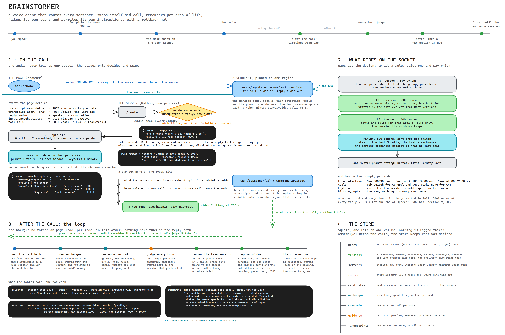

# Brainstormer

A voice agent that knows which part of your life you are in, remembers it, and rewrites its own instructions from the turns that went wrong.

Built for the AssemblyAI Voice Agent Hackathon.

## Why we built it

In a text chat, you open a new chat for each topic. On a voice call there is only one thread. You jump from topic to topic, and the agent has to keep up.

Most voice agents use one prompt for every conversation. We saw three problems with that:

- **One style does not fit every topic.** At the gym you want one sentence between sets. When you think through a design, you want the agent to wait and listen.
- **It forgets.** The last call is gone the moment you hang up.
- **Mistakes stay.** When a reply goes wrong, nobody rewrites the prompt. The same mistake waits for the next call.

> "First you will listen, then you pass your judgment."
>
> A caller during testing. The agent had filled every pause in the sentence.

So we wanted a voice agent that does three things:

1. **Understands the context.** It knows what was said before, and what you mean now.
2. **Adjusts to the topic.** It changes how it responds when the subject changes.
3. **Improves on evidence.** It gets better along the way, whenever there is clear evidence.

We did not find a voice agent that does all three today. That is why we built Brainstormer.

## What a mode is

A mode is one part of your life: Gym, Deep work, Travel. It is more than a prompt. Each mode has its own:

| Part | What it changes |
| --- | --- |
| Prompt | How the agent talks about this subject |
| Waiting time | How long it stays quiet before it replies |
| Key words | Words the transcriber should expect, like names and jargon |
| Tools | What it may use, for example web search |
| Memory | Notes from your last calls on this subject |

Three modes come with the project:

| Mode | Waits before replying | Tools |
| --- | --- | --- |
| General | 800 ms | web search |
| Deep work | 1800 ms, because a pause is a thought | web search |
| Gym | 300 ms, because you are between sets | none |

Your gym talk does not leak into your work talk. A small shared part holds the facts that are true everywhere, so the agent still knows who you are when the subject changes.

## How it works

**During the call**

1. You speak. Your voice goes from the browser straight to AssemblyAI.
2. While you speak, a small decision model picks the mode that fits what you said.
3. If the mode changes, the new setup is sent on the same call. The call does not restart and nothing you said is lost.
4. If you talk about something new, Brainstormer makes a new mode for it in the middle of the call.

**After the call**

5. It reads the call back and writes one short note, so the next call can pick up where you stopped.
6. It judges every reply: was it about the right problem, did it answer, did you push back.
7. If a mode keeps failing in the same way, it writes a new version of that mode and starts using it.
8. After a few more calls it compares the new version with the old one. If the new one is worse, it goes back.

Every version is saved with the reason for the change. The evolution page shows what changed between two versions.



Click the picture to see it in full size.

## Try it

Live demo: https://brainstomer-production.up.railway.app

The demo asks for a password. It is shared on request.

1. Allow the microphone and start a call.
2. Say: "I'm submitting my hackathon project tomorrow."
3. Watch the mode switch on the page.
4. Ask it what you talked about last time.

Open `/evolution` on the demo to see the versions of each mode.

## Run it yourself

You need Python 3.12 and a browser with a microphone.

### 1. Get the code

```bash
git clone https://github.com/Vishalkagade/brainstomer.git
cd brainstomer
python3.12 -m venv .venv
.venv/bin/pip install -r requirements.txt
```

### 2. Get the keys

| Key | Used for | Where to get it |
| --- | --- | --- |
| `ASSEMBLYAI_API_KEY` | The call itself | https://www.assemblyai.com/dashboard/api-keys |
| `FIREWORKS_API_KEY` | Writing new versions, call notes, naming new modes | https://app.fireworks.ai/settings/users/api-keys |
| `EXA_API_KEY` | Web search | https://dashboard.exa.ai/api-keys |
| `TYPESAFE_API_KEY` | Picking the mode and judging replies | Waitlist only, see below |

### 3. Write the `.env` file

Make a file named `.env` in the project folder:

```
ASSEMBLYAI_API_KEY=your-key
FIREWORKS_API_KEY=your-key
EXA_API_KEY=your-key
JEV=off
```

Put each setting on its own line. Do not add a comment after a value.

**Why `JEV=off`?** Brainstormer uses a decision model called Jev, made by TypeSafe, to pick the mode and to judge replies. TypeSafe gives keys through a waitlist, so most people cannot get one today. `JEV=off` tells Brainstormer not to ask Jev at all.

With `JEV=off`:

- Brainstormer still picks the mode, in a simpler way. It compares your sentence with a short description of each mode. This is less exact than Jev.
- Replies are not judged. Without judged replies the modes do not improve on their own. You can still talk, switch modes and use memory.

If you have a TypeSafe key, add `TYPESAFE_API_KEY=your-key` and remove the `JEV=off` line.

If your calls should stay in one region, add `ASSEMBLYAI_REGION=eu` or `ASSEMBLYAI_REGION=us`.

### 4. Create the agent

```bash
.venv/bin/python app/agent.py
```

Run this once. It creates the agent in your AssemblyAI account and saves its id in `.env`.

### 5. Start

```bash
.venv/bin/python app/server.py
```

Open http://localhost:3000 and allow the microphone.

On the first start Brainstormer creates its store and loads the three modes. It starts with an empty profile of you and fills it from your calls.

## What is not done yet
- **It can talk over slow speakers.** If you pause for long in the middle of a sentence, it may reply too early.
- **Small talk can become a mode.** Words like "hello" or "you are late" are sometimes grouped into a mode of their own.
- **One person only.** There are no accounts. Everyone who calls is treated as the same person.
- **Only tested in Europe.** The `us` region setting exists but was not tried.
- **Running without a TypeSafe key is the simple version.** See `JEV=off` above.
